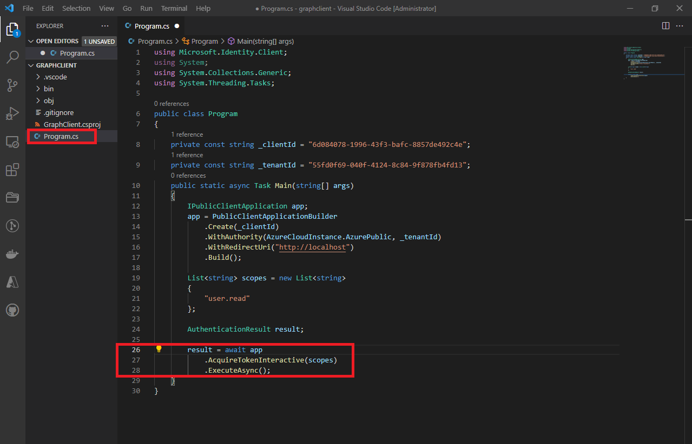
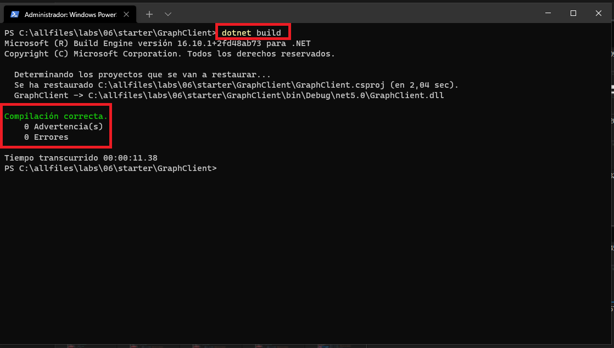
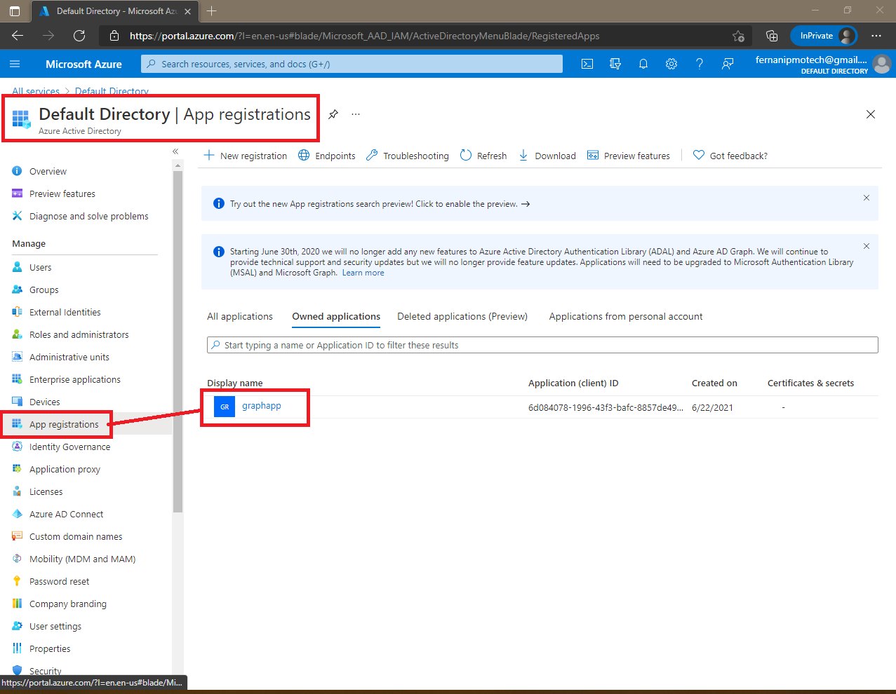

# Lab 06: Authenticating to and querying Microsoft Graph by using MSAL and .NET SDKs

## Microsoft Azure user interface

Given the dynamic nature of Microsoft cloud tools, you might experience Azure UI changes after the development of this training content. These changes might cause the lab instructions and lab steps to not match up.

Microsoft updates this training course when the community brings needed changes to our attention; however, because cloud updates occur frequently, you might encounter UI changes before this training content updates. **If this occurs, adapt to the changes, and then work through them in the labs as needed.**

## Instructions

### Before you start

#### Sign in to the lab virtual machine

Sign in to your Windows 10 virtual machine (VM) by using the following credentials:

- Username: **Admin**
- Password: **Pa55w.rd**

> **Note**: Instructions to connect to the virtual lab environment will be provided by your instructor.

#### Review the installed applications

Find the taskbar on your Windows 10 desktop. The taskbar contains the icons for the applications that you’ll use in this lab:

- Microsoft Edge
- Visual Studio Code


**Architecture**


### Exercise 1: Create an Azure Active Directory (Azure AD) application registration

#### Task 1: Open the Azure portal

1. On the taskbar, select the **Microsoft Edge** icon.

2. In the open browser window, go to the Azure portal ([https://portal.azure.com](https://portal.azure.com/)).

3. Enter the email address for your Microsoft account, and then select **Next**.

4. Enter the password for your Microsoft account, and then select **Sign in**.

   > **Note**: If this is your first time signing in to the Azure portal, you’ll be offered a tour of the portal. Select **Get Started** to skip the tour and begin using the portal.

#### Task 2: Create an application registration

1. In the Azure portal’s navigation pane, select **All services**.

2. From the **All services** blade, select **Azure Active Directory**.

3. From the **Azure Active Directory** blade, select **App registrations** in the **Manage** section.

   

4. In the **App registrations** section, select **New registration**.

   

5. In the **Register an application** section, perform the following actions:
   1. In the **Name** text box, enter **graphapp**.
   2. In the **Supported account types** list, select the **Accounts in this organizational directory only (Default Directory only - Single tenant)** check box.
   3. In the **Redirect URI** drop-down list, select **Public client/native (mobile & desktop)**.
   4. In the **Redirect URI** text box, enter **http://localhost**.
   5. Select **Register**.

   

#### Task 3: Enable the default client type

1. In the **graphapp** application registration blade, select **Authentication** in the **Manage** section.

   

2. In the **Authentication** section, perform the following actions:
   1. In the **Advanced settings** - **Allow public client flows** subsection, select **Yes**.

      

   2. Select **Save**.

      

#### Task 4: Record unique identifiers

1. On the **graphapp** application registration blade, select **Overview**.

2. In the **Overview** section, find and record the value of the **Application (client) ID** text box. You’ll use this value later in the lab.

   

3. In the **Overview** section, find and record the value of the **Directory (tenant) ID** text box. You’ll use this value later in the lab.

   

#### Review

In this exercise, you created a new application registration and recorded important values that you’ll need later in the lab.

### Exercise 2: Obtain a token by using the MSAL.NET library

#### Task 1: Create a .NET project

1. On the **Start** screen, select the **Visual Studio Code** tile.

2. On the **File** menu, select **Open Folder**.

3. In the **File Explorer** window that opens, browse to **Allfiles (F):\Allfiles\Labs\06\Starter\GraphClient**, and then select **Select Folder**.

4. In the **Visual Studio Code** window, right-click or activate the shortcut menu for the Explorer pane, and then select **Open in Terminal**.

5. At the open command prompt, enter the following command, and then select Enter to create a new .NET project named **GraphClient** in the current folder:

   CodeCopy

   ```
   dotnet new console --name GraphClient --output .
   ```

   > **Note**: The **dotnet new** command will create a new **console** project in a folder with the same name as the project.

   

6. At the command prompt, enter the following command, and then select Enter to import version 4.7.1 of **Microsoft.Identity.Client** from NuGet:

   CodeCopy

   ```
   dotnet add package Microsoft.Identity.Client --version 4.7.1
   ```

   > **Note**: The **dotnet add package** command will add the **Microsoft.Identity.Client** package from NuGet. For more information, go to [Microsoft.Identity.Client](https://www.nuget.org/packages/Microsoft.Identity.Client/4.7.1).

   

   

   

7. At the command prompt, enter the following command, and then select Enter to build the .NET web application:

   CodeCopy

   ```
   dotnet build
   ```

   

8. Select **Kill Terminal** or the **Recycle Bin** icon to close the currently open terminal and any associated processes.

#### Task 2: Modify the Program class

1. In the Explorer pane of the **Visual Studio Code** window, open the **Program.cs** file.

   

2. On the code editor tab for the **Program.cs** file, delete all the code in the existing file.

   

3. Add the following line of code to import the **Microsoft.Identity.Client** namespace from the **Microsoft.Identity.Client** package imported from NuGet:

   CodeCopy

   ```
   using Microsoft.Identity.Client;
   ```

   

4. Add the following lines of code to add **using** directives for the built-in namespaces that will be used in this file:

   CodeCopy

   ```
   using System;
   using System.Collections.Generic;
   using System.Threading.Tasks;
   ```

   

5. Enter the following code to create a new **Program** class:

   CodeCopy

   ```
   public class Program
   {
   }
   ```

   

6. In the **Program** class, enter the following code to create a new asynchronous **Main** method:

   CodeCopy

   ```
   public static async Task Main(string[] args)
   {
   }
   ```

   

7. In the **Program** class, enter the following line of code to create a new string constant named **_clientId**:

   CodeCopy

   ```
   private const string _clientId = "";
   ```

8. Update the **_clientId** string constant by setting its value to the **Application (client) ID** that you recorded earlier in this lab

   

9. In the **Program** class, enter the following line of code to create a new string constant named **_tenantId**:

   CodeCopy

   ```
   private const string _tenantId = "";
   ```

10. Update the **_tenantId** string constant by setting its value to the **Directory (tenant) ID** that you recorded earlier in this lab.

    

11. Observe the **Program.cs** file, which should now include:

    CodeCopy

    ```
    using Microsoft.Identity.Client;
    using System;
    using System.Collections.Generic;
    using System.Threading.Tasks;
    
    public class Program
    {
        private const string _clientId = "<app-reg-client-id>";        
        private const string _tenantId = "<aad-tenant-id>";
    
        public static async Task Main(string[] args)
        {
        }
    }
    ```


#### Task 3: Obtain a Microsoft Authentication Library (MSAL) token

1. In the **Main** method, add the following line of code to create a new variable named *app* of type **[IPublicClientApplication](https://docs.microsoft.com/dotnet/api/microsoft.identity.client.ipublicclientapplication)**:

   CodeCopy

   ```
   IPublicClientApplication app;
   ```

   

2. In the **Main** method, perform the following actions to build a public client application instance by using the static **[PublicClientApplicationBuilder](https://docs.microsoft.com/dotnet/api/microsoft.identity.client.publicclientapplicationbuilder)** class, and then store it in the *app* variable:

   1. Add the following line of code to access the static **[PublicClientApplicationBuilder](https://docs.microsoft.com/dotnet/api/microsoft.identity.client.publicclientapplicationbuilder)** class:

      CodeCopy

      ```
      PublicClientApplicationBuilder
      ```

      

   2. Update the previous line of code by adding another line of code to use the **[Create()](https://docs.microsoft.com/dotnet/api/microsoft.identity.client.publicclientapplicationbuilder.create)** method of the **PublicClientApplicationBuilder** class, passing in the *_clientId* variable as a parameter:

      CodeCopy

      ```
      PublicClientApplicationBuilder
          .Create(_clientId)
      ```

      

   3. Update the previous line of code by adding another line of code to use the **[WithAuthority()](https://docs.microsoft.com/dotnet/api/microsoft.identity.client.abstractapplicationbuilder-1.withauthority)** method of the base **[AbstractApplicationBuilder<>](https://docs.microsoft.com/dotnet/api/microsoft.identity.client.abstractapplicationbuilder-1)** class, passing in the enumeration value **[AzureCloudInstance.AzurePublic](https://docs.microsoft.com/dotnet/api/microsoft.identity.client.azurecloudinstance)** and the *_tenantId* variable as parameters:

      CodeCopy

      ```
      PublicClientApplicationBuilder
          .Create(_clientId)
          .WithAuthority(AzureCloudInstance.AzurePublic, _tenantId)
      ```

      

   4. Update the previous line of code by adding another line of code to use the **[WithRedirectUri()](https://docs.microsoft.com/dotnet/api/microsoft.identity.client.abstractapplicationbuilder-1.withredirecturi)** method of the base **AbstractApplicationBuilder<>** class, passing in a string value of **http://localhost**:

      CodeCopy

      ```
      PublicClientApplicationBuilder
          .Create(_clientId)
          .WithAuthority(AzureCloudInstance.AzurePublic, _tenantId)
          .WithRedirectUri("http://localhost")
      ```

      

   5. Update the previous line of code by adding another line of code to use the **[Build()](https://docs.microsoft.com/dotnet/api/microsoft.identity.client.publicclientapplicationbuilder.build)** method of the **PublicClientApplication** class:

      CodeCopy

      ```
      PublicClientApplicationBuilder
          .Create(_clientId)
          .WithAuthority(AzureCloudInstance.AzurePublic, _tenantId)
          .WithRedirectUri("http://localhost")
          .Build();
      ```

      

   6. Update the previous line of code by adding more code to store the result of the expression in the *app* variable:

      CodeCopy

      ```
      app = PublicClientApplicationBuilder
          .Create(_clientId)
          .WithAuthority(AzureCloudInstance.AzurePublic, _tenantId)
          .WithRedirectUri("http://localhost")
          .Build();
      ```

   

3. In the **Main** method, add the following line of code to create a new generic string **[List<>](https://docs.microsoft.com/dotnet/api/system.collections.generic.list-1)** with a single value of **user.read**:

   CodeCopy

   ```
   List<string> scopes = new List<string> 
   { 
       "user.read" 
   };
   ```

   

4. In the **Main** method, add the following line of code to create a new variable named *result* of type **[AuthenticationResult](https://docs.microsoft.com/dotnet/api/microsoft.identity.client.authenticationresult)**:

   CodeCopy

   ```
   AuthenticationResult result;
   ```

   

5. In the **Main** method, perform the following actions to acquire a token interactively and store the output in the *result* variable:

   1. Add the following line of code to access the *app* variable:

      CodeCopy

      ```
      app
      ```

      

   2. Update the previous line of code by adding another line of code to use the **[AcquireTokenInteractive()](https://docs.microsoft.com/dotnet/api/microsoft.identity.client.ipublicclientapplication.acquiretokeninteractive)** method of the **IPublicClientApplicationBuilder** interface, passing in the *scopes* variable as a parameter:

      CodeCopy

      ```
      app
          .AcquireTokenInteractive(scopes)
      ```

      

   3. Update the previous line of code by adding another line of code to use the **[ExecuteAsync()](https://docs.microsoft.com/dotnet/api/microsoft.identity.client.abstractacquiretokenparameterbuilder-1.executeasync)** method of the **[AbstractAcquireTokenParameterBuilder](https://docs.microsoft.com/dotnet/api/microsoft.identity.client.abstractacquiretokenparameterbuilder-1)** class:

      CodeCopy

      ```
      app
          .AcquireTokenInteractive(scopes)
          .ExecuteAsync();
      ```

      

   4. Update the previous line of code by adding more code to process the expression asynchronously by using the **await** keyword:

      CodeCopy

      ```
      await app
          .AcquireTokenInteractive(scopes)
          .ExecuteAsync();
      ```

      

   5. Update the previous line of code by adding more code to store the result of the expression in the *result* variable:

      CodeCopy

      ```
      result = await app
          .AcquireTokenInteractive(scopes)
          .ExecuteAsync();
      ```

   

6. In the **Main** method, add the following line of code to use the **Console.WriteLine** method to render the value of the **[AuthenticationResult.AccessToken](https://docs.microsoft.com/dotnet/api/microsoft.identity.client.authenticationresult.accesstoken)** member to the console:

   CodeCopy

   ```
   Console.WriteLine($"Token:\t{result.AccessToken}");
   ```

   

7. Observe the **Main** method, which should now include:

   CodeCopy

   ```
   public static async Task Main(string[] args)
   {
       IPublicClientApplication app;
   
       app = PublicClientApplicationBuilder
           .Create(_clientId)
           .WithAuthority(AzureCloudInstance.AzurePublic, _tenantId)
           .WithRedirectUri("http://localhost")
           .Build();
   
       List<string> scopes = new List<string> 
       { 
           "user.read"
       };
   
       AuthenticationResult result;
           
       result = await app
           .AcquireTokenInteractive(scopes)
           .ExecuteAsync();
   
       Console.WriteLine($"Token:\t{result.AccessToken}");
   }
   ```

   

8. Save the **Program.cs** file.

   

#### Task 4: Test the updated application

1. In the **Visual Studio Code** window, right-click or activate the shortcut menu for the Explorer pane, and then select **Open in Terminal**.

2. At the open command prompt, enter the following command, and then select Enter to run the .NET web application:

   CodeCopy

   ```
   dotnet run
   ```

   > **Note**: If there are any build errors, review the **Program.cs** file in the **Allfiles (F):\Allfiles\Labs\06\Solution\GraphClient** folder.

   

   

3. The running console application will automatically open an instance of the default browser.

4. In the open browser window, perform the following actions:

   1. Enter the email address for your Microsoft account, and then select **Next**.
   2. Enter the password for your Microsoft account, and then select **Sign in**.

   > **Note**: You might have the option to select an existing Microsoft account as opposed to signing in again.

5. The browser window will automatically open the **Permissions requested** webpage. On this webpage, perform the following actions:

   1. Review the requested permissions.

   2. Select **Accept**.

      

6. Return to the currently running Visual Studio Code application.

7. Observe the token rendered in the output from the currently running console application.

   

8. Select **Kill Terminal** or the **Recycle Bin** icon to close the currently open terminal and any associated processes.

#### Review

In this exercise, you acquired a token from the Microsoft identity platform by using the MSAL.NET library.

### Exercise 3: Query Microsoft Graph by using the .NET SDK

#### Task 1: Import the Microsoft Graph SDK from NuGet

1. In the **Visual Studio Code** window, right-click or activate the shortcut menu for the Explorer pane, and then select **Open in Terminal**.

2. At the command prompt, enter the following command, and then select Enter to import version 1.21.0 of **Microsoft.Graph** from NuGet:

   CodeCopy

   ```
   dotnet add package Microsoft.Graph --version 1.21.0
   ```

   > **Note**: The **dotnet add package** command will add the **Microsoft.Graph** package from NuGet. For more information, go to [Microsoft.Graph](https://www.nuget.org/packages/Microsoft.Graph/1.21.0).

   

3. At the command prompt, enter the following command, and then select Enter to import version 1.0.0-preview.2 of **Microsoft.Graph.Auth** from NuGet:

   CodeCopy

   ```
   dotnet add package Microsoft.Graph.Auth --version 1.0.0-preview.2
   ```

   > **Note**: The **dotnet add package** command will add the **Microsoft.Graph.Auth** package from NuGet. For more information, go to [Microsoft.Graph.Auth](https://www.nuget.org/packages/Microsoft.Graph.Auth/1.0.0-preview.2).

   

4. At the command prompt, enter the following command, and then select Enter to build the .NET web application:

   CodeCopy

   ```
   dotnet build
   ```

   

5. Select **Kill Terminal** or the **Recycle Bin** icon to close the currently open terminal and any associated processes.

#### Task 2: Modify the Program class

1. In the Explorer pane of the **Visual Studio Code** window, open the **Program.cs** file.

2. On the code editor tab for the **Program.cs** file, add the following line of code to import the **Microsoft.Graph** namespace from the **Microsoft.Graph** package imported from NuGet:

   CodeCopy

   ```
   using Microsoft.Graph;
   ```

   

3. Add the following line of code to import the **Microsoft.Graph.Auth** namespace from the **Microsoft.Graph.Auth** package imported from NuGet:

   CodeCopy

   ```
   using Microsoft.Graph.Auth;
   ```

   

4. Observe the **Program.cs** file, which should now include the following **using** directives:

   CodeCopy

   ```
   using Microsoft.Graph;    
   using Microsoft.Graph.Auth;
   using Microsoft.Identity.Client;
   using System;
   using System.Collections.Generic;
   using System.Threading.Tasks;
   ```


#### Task 3: Use the Microsoft Graph SDK to query user profile information

1. Within the **Main** method, perform the following actions to remove unnecessary code:

   1. Delete the following line of code:

      CodeCopy

      ```
      AuthenticationResult result;
      ```

      

      

      

   2. Delete the following block of code:

      CodeCopy

      ```
      result = await app
              .AcquireTokenInteractive(scopes)
              .ExecuteAsync();
      ```

      

      

   3. Delete the following line of code:

      CodeCopy

      ```
      Console.WriteLine($"Token:\t{result.AccessToken}");
      ```

   

2. Observe the **Main** method, which should now include:

   CodeCopy

   ```
   public static async Task Main(string[] args)
   {
       IPublicClientApplication app;
   
       app = PublicClientApplicationBuilder
           .Create(_clientId)
           .WithAuthority(AzureCloudInstance.AzurePublic, _tenantId)
           .WithRedirectUri("http://localhost")
           .Build();
   
       List<string> scopes = new List<string> 
       { 
           "user.read"
       };
   }
   ```

   

3. In the **Main** method, add the following line of code to create a new variable named *provider* of type **DeviceCodeProvider** that passes in the variables *app* and *scopes* as constructor parameters:

   CodeCopy

   ```
   DeviceCodeProvider provider = new DeviceCodeProvider(app, scopes);
   ```

   

4. In the **Main** method, add the following line of code to create a new variable named *client* of type **GraphServiceClient** that passes in the variable *provider* as a constructor parameter:

   CodeCopy

   ```
   GraphServiceClient client = new GraphServiceClient(provider);
   ```

   

5. In the **Main** method, perform the following actions to use the **GraphServiceClient** instance to asynchronously get the response of issuing an HTTP request to the relative **/Me** directory of the REST API:

   1. Add the following line of code to get the **Me** property of the *client* variable:

      CodeCopy

      ```
      client.Me
      ```

      

   2. Update the previous line of code by adding another line of code to get an object representing the HTTP request by using the **Request()** method:

      CodeCopy

      ```
      client.Me
          .Request()
      ```

      

   3. Update the previous line of code by adding another line of code to issue the request asynchronously by using the **GetAsync()** method:

      CodeCopy

      ```
      client.Me
          .Request()
          .GetAsync()
      ```

      

   4. Update the previous line of code by adding more code to process the expression asynchronously by using the **await** keyword:

      CodeCopy

      ```
      await client.Me
          .Request()
          .GetAsync()
      ```

      

   5. Update the previous line of code by adding more code to store the result of the expression in a new variable named *myProfile* of type **User**:

      CodeCopy

      ```
      User myProfile = await client.Me
          .Request()
          .GetAsync();
      ```

   

6. In the **Main** method, add the following line of code to use the **Console.WriteLine** method to render the value of the **User.DisplayName** member to the console:

   CodeCopy

   ```
   Console.WriteLine($"Name:\t{myProfile.DisplayName}");
   ```

   

7. In the **Main** method, add the following line of code to use the **Console.WriteLine** method to render the value of the **User.Id** member to the console:

   CodeCopy

   ```
   Console.WriteLine($"AAD Id:\t{myProfile.Id}");
   ```

   

8. Observe the **Main** method, which should now include:

   CodeCopy

   ```
   public static async Task Main(string[] args)
   {
       IPublicClientApplication app;
   
       app = PublicClientApplicationBuilder
           .Create(_clientId)
           .WithAuthority(AzureCloudInstance.AzurePublic, _tenantId)
           .WithRedirectUri("http://localhost")
           .Build();
   
       List<string> scopes = new List<string> 
       { 
           "user.read" 
       };
   
       DeviceCodeProvider provider = new DeviceCodeProvider(app, scopes);
   
       GraphServiceClient client = new GraphServiceClient(provider);
   
       User myProfile = await client.Me
           .Request()
           .GetAsync();
   
       Console.WriteLine($"Name:\t{myProfile.DisplayName}");
       Console.WriteLine($"AAD Id:\t{myProfile.Id}");
   }
   ```

   

9. Save the **Program.cs** file.

   

#### Task 4: Test the updated application

1. In the **Visual Studio Code** window, right-click or activate the shortcut menu for the Explorer pane, and then select **Open in Terminal**.

2. At the open command prompt, enter the following command, and then select Enter to run the .NET web application:

   CodeCopy

   ```
   dotnet run
   ```

   > **Note**: If there are any build errors, review the **Program.cs** file in the **Allfiles (F):\Allfiles\Labs\06\Solution\GraphClient** folder.

   

3. Observe the message in the output from the currently running console application. Record the value of the code in the message. You’ll use this value later in the lab.

4. On the taskbar, select the **Microsoft Edge** icon.

5. In the open browser window, go to https://microsoft.com/devicelogin.

6. On the **Enter code** webpage, perform the following actions:

   1. In the **Code** text box, enter the value of the code that you copied earlier in the lab.

   2. Select **Next**.

      

7. On the login webpage, perform the following actions:

   1. Enter the email address for your Microsoft account, and then select **Next**.

      

   2. Enter the password for your Microsoft account, and then select **Sign in**.

   > **Note**: You might have the option to select an existing Microsoft account as opposed to signing in again.

   

   

8. Return to the currently running Visual Studio Code application.

9. Observe the output from the Microsoft Graph request in the currently running console application.

   

10. Select **Kill Terminal** or the **Recycle Bin** icon to close the currently open terminal and any associated processes.

#### Review

In this exercise, you queried Microsoft Graph by using the SDK and MSAL-based authentication.

### Exercise 4: Clean up your subscription

#### Task 1: Delete the application registration in Azure AD

1. Return to the browser window with the Azure portal.

2. In the Azure portal’s navigation pane, select **All services**.

3. From the **All services** blade, select **Azure Active Directory**.

   

4. From the **Azure Active Directory** blade, select **App registrations** in the **Manage** section.

5. In the **App registrations** section, select the **graphapp** Azure AD application registration that you created earlier in this lab.

   

6. In the **graphapp** section, perform the following actions:
   1. Select **Delete**.

      

   2. In the confirmation pop-up dialog box, select **Yes**.

      

#### Task 2: Close the active applications

1. Close the currently running Microsoft Edge application.
2. Close the currently running Visual Studio Code application.

#### Review

In this exercise, you cleaned up your subscription by removing the application registration used in this lab.