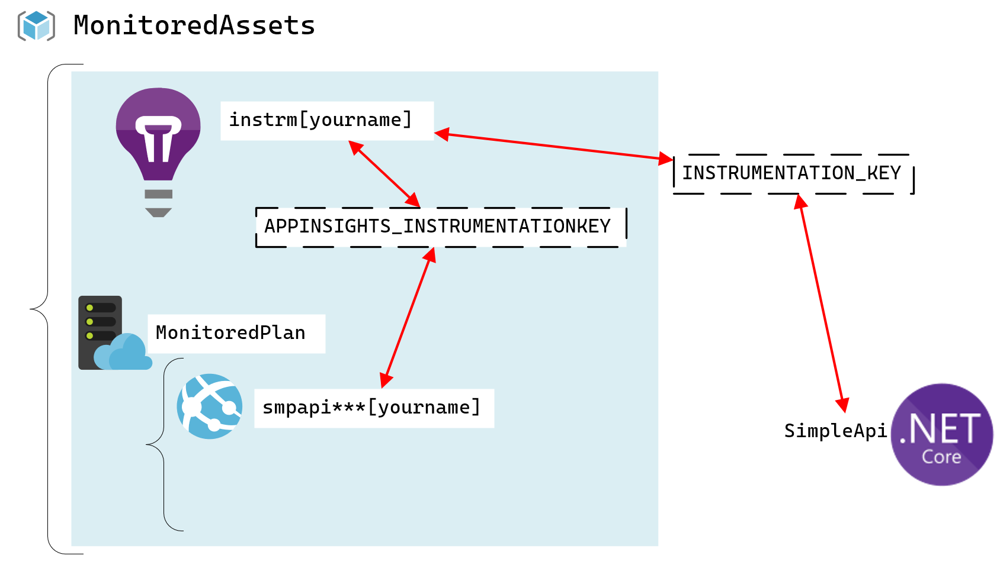
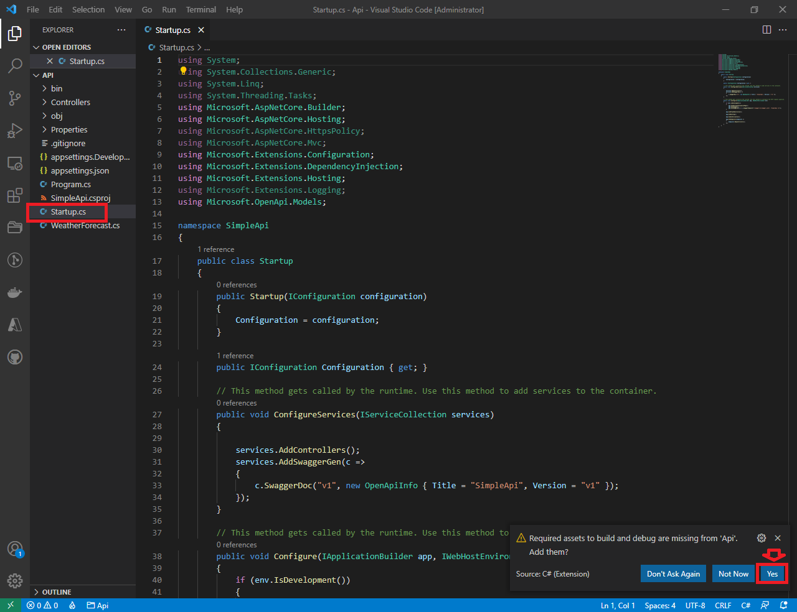
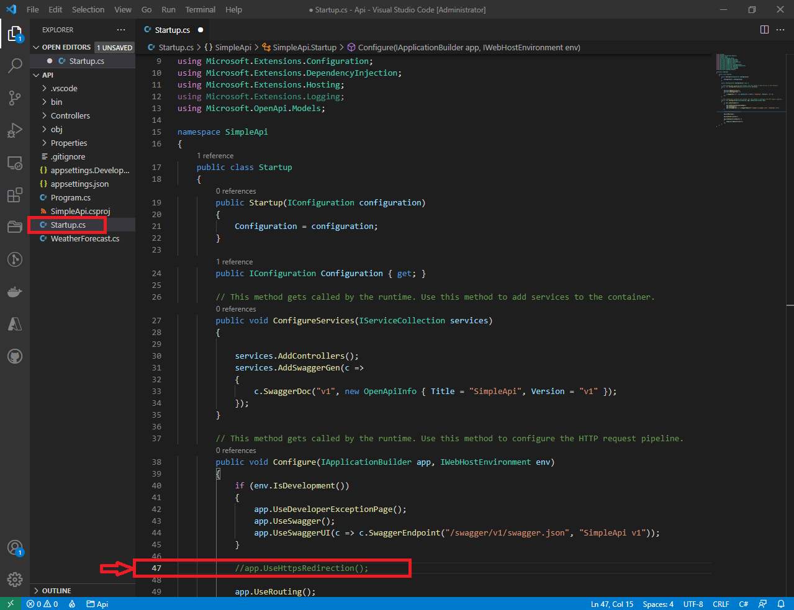
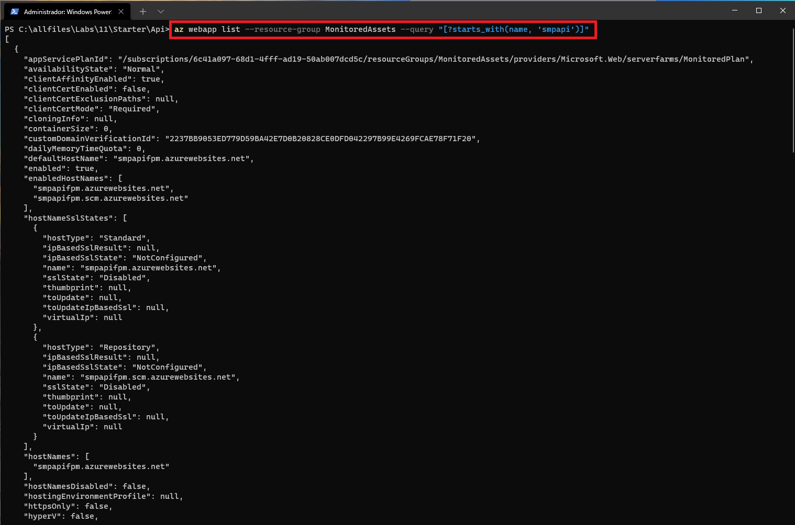
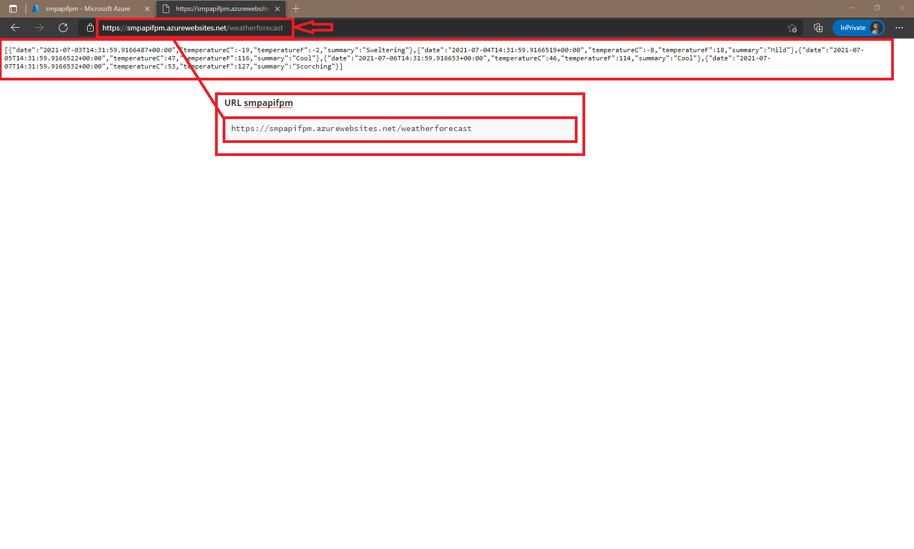

# Lab 11: Monitoring services that are deployed to Azure

## Microsoft Azure user interface

Given the dynamic nature of Microsoft cloud tools, you might experience Azure UI changes after the development of this training content. These changes might cause the lab instructions and steps to not match up.

Microsoft updates this training course when the community brings needed changes to our attention. However, because cloud updates occur frequently, you might encounter UI changes before this training content updates. **If this occurs, adapt to the changes, and then work through them in the labs as needed.**

## Instructions

### Before you start

#### Sign in to the lab virtual machine

Sign in to your Windows 10 virtual machine (VM) by using the following credentials:

- Username: **Admin**
- Password: **Pa55w.rd**

> **Note**: Instructions to connect to the virtual lab environment will be provided by your instructor.

#### Review the installed applications

Find the taskbar on your Windows 10 desktop. The taskbar contains the icons for the applications that you’ll use in this lab:

- Microsoft Edge
- File Explorer
- Visual Studio Code
- Windows PowerShell



### Exercise 1: Create and configure Azure resources

#### Task 1: Open the Azure portal

1. On the taskbar, select the **Microsoft Edge** icon.
2. In the open browser window, go to the Azure portal ([https://portal.azure.com](https://portal.azure.com/)).
3. From the sign-in page, enter the email address for your Microsoft account, and then select **Next**.
4. Enter the password for your Microsoft account, and then select **Sign in**.

> **Note**: If this is your first time signing in to the Azure portal, a dialog box will display an offer to tour the portal. Select **Get Started** to skip the tour and begin using the portal.

#### Task 2: Create an Application Insights resource

1. In the Azure portal’s navigation pane, select **Create a resource**.

2. From the **Create a resource** blade, find the **Search services and marketplace** text box.

3. In the search box, enter **Insights**, and then select Enter.

4. From the **Marketplace** search results blade, select the **Application Insights** result.

   

5. From the **Application Insights** blade, select **Create**.

   

6. Find the tabs from the second **Application Insights** blade, such as **Basics**.

   > **Note**: Each tab represents a step in the workflow to create a new Application Insights instance. You can select **Review + Create** at any time to skip the remaining tabs.

7. From the **Basics** tab, perform the following actions:

   1. Leave the **Subscription** text box set to its default value.

   2. In the **Resource group** section, select **Create new**, enter **MonitoredAssets**, and then select **OK**.

   3. In the **Name** text box, enter **instrm\*[yourname]\***.

   4. In the **Region** drop-down list, select the **(US) East US** region.

   5. In the **Resource Mode** section, select the **Classic** option.

   6. Select **Review + Create**.

      

8. From the **Review + Create** tab, review the options that you selected during the previous steps.

9. Select **Create** to create the Application Insights instance by using your specified configuration.

   

   > **Note**: Wait for the creation task to complete before you move forward with this lab.

   

   

10. In the Azure portal’s navigation pane, select **Resource groups**.

11. From the **Resource groups** blade, select the **MonitoredAssets** resource group that you created earlier in this lab.

12. From the **MonitoredAssets** blade, select the **instrm\*[yourname]\*** Application Insights account that you created earlier in this lab.

    

13. From the **Application Insights** blade, in the **Configure** category, select the **Properties** link.

14. In the **Properties** section, find the value of the **Instrumentation Key** text box. This key is used by client applications to connect to Application Insights.

    

#### Task 3: Create a web app by using Azure App Services resource

1. In the Azure portal’s navigation pane, select **Create a resource**.

2. From the **Create a resource** blade, find the **Search services and marketplace** text box.

3. In the search box, enter **Web App**, and then select Enter.

   

4. From the **Marketplace** search results blade, select the **Web App** result.

5. From the **Web App** blade, select **Create**.

   

6. Find the tabs from the **Create Web App** blade, such as **Basics**.

   > **Note**: Each tab represents a step in the workflow to create a new web app. You can select **Review + Create** at any time to skip the remaining tabs.

7. From the **Basics** tab, perform the following actions:

   1. Leave the **Subscription** text box set to its default value.

   2. In the **Resource group** drop-down list, select **MonitoredAssets**.

   3. In the **Name** text box, enter ***smpapi\**\*[yourname]\***.

   4. In the **Publish** section, select **Code**.

   5. In the **Runtime stack** drop-down list, select **.NET Core 3.1 (LTS)**.

   6. In the **Operating System** section, select **Windows**.

   7. In the **Region** drop-down list, select the **East US** region.

   8. In the **Windows Plan (East US)** section, select **Create new**, enter the value **MonitoredPlan** into the **Name** text box, and then select **OK**.

   9. Leave the **SKU and size** section set to its default value.

   10. Select **Next: Deployment (Preview)**.

       

8. From the **Deployment (Preview)** tab, perform the following actions:

   1. Select **Next: Monitoring**.

      

9. From the **Monitoring** tab, perform the following actions:

   1. In the **Enable Application Insights** section, select **Yes**.

   2. In the **Application Insights** drop-down list, select the **instrm\*[yourname]\*** Application Insights account that you created earlier in this lab.

   3. Select **Review + Create**.

      

10. From the **Review + Create** tab, review the options that you selected during the previous steps.

11. Select **Create** to create the web app by using your specified configuration.

    

    > **Note**: Wait for the creation task to complete before you move forward with this lab.

    

12. In the Azure portal’s navigation pane, select **Resource groups**.

13. From the **Resource groups** blade, select the **MonitoredAssets** resource group that you created earlier in this lab.

14. From the **MonitoredAssets** blade, select the ***smpapi\**\*[yourname]\*** web app that you created earlier in this lab.

    

15. From the **App Service** blade, in the **Settings** category, select the **Configuration** link.

16. In the **Configuration** section, perform the following actions:

    1. Select the **Application settings** tab.

    2. Select **Show Values** to get the secrets associated with your API.

       

    3. Find the value corresponding to the **APPINSIGHTS_INSTRUMENTATIONKEY** key. This value was set automatically when you built your Web Apps resource.

       

17. From the **App Service** blade, in the **Settings** category, select the **Properties** link.

18. In the **Properties** section, record the value of the **URL** text box. You’ll use this value later in the lab to make requests against the API.

    

#### Task 4: Configure web app autoscale options

1. From the **App Service** blade, in the **Settings** category, select the **Scale out (App Service Plan)** link.

2. In the **Scale out** section, perform the following actions:

   1. Select **Custom autoscale**.

      

   2. In the **Autoscale setting name** text box, enter **ComputeScaler**.

   3. In the **Resource group** list, select **MonitoredAssets**.

   4. In the **Scale mode** section, select **Scale based on a metric**.

   5. In the **Minimum** text box in the **Instance limits** section, enter **2**.

   6. In the **Maximum** text box in the **Instance limits** section, enter **8**.

   7. In the **Default** text box in the **Instance limits** section, enter **3**.

      

   8. Select **Add a rule**. In the **Scale rule** pop-up dialog, leave all boxes set to their default values, and then select **Add**.

      

   9. Within the section, select **Save**.

      

   > **Note**: Wait for the save operation to complete before you move forward with this lab.


#### Review

In this exercise, you created the resources that you’ll use for the remainder of the lab.

### Exercise 2: Monitor a local web application by using Application Insights

#### Task 1: Build a .NET Web API project

1. On the taskbar, select the **Visual Studio Code** icon.

2. From the **File** menu, select **Open Folder**.

3. In the **File Explorer** window, browse to **Allfiles (F):\Allfiles\Labs\11\Starter\Api**, and then select **Select Folder**.

4. In the **Visual Studio Code** window, right-click the Explorer pane or activate the shortcut menu, and then select **Open in Terminal**.

5. At the **Open** command prompt, enter the following command, and then select Enter to create a new .NET Web API application named **SimpleApi** in the current directory:

   CodeCopy

   ```
   dotnet new webapi --output . --name SimpleApi
   ```

   

6. At the command prompt, enter the following command, and then select Enter to import version 2.14.0 of **Microsoft.ApplicationInsights** from NuGet to the current project:

   CodeCopy

   ```
   dotnet add package Microsoft.ApplicationInsights --version 2.14.0
   ```

   > **Note**: The **dotnet add package** command will add the **Microsoft.ApplicationInsights** package from NuGet. For more information, go to [Microsoft.ApplicationInsights](https://www.nuget.org/packages/Microsoft.ApplicationInsights/2.14.0).

   

7. At the command prompt, enter the following command, and then select Enter to import version 2.14.0 of **Microsoft.ApplicationInsights.AspNetCore** from NuGet:

   CodeCopy

   ```
   dotnet add package Microsoft.ApplicationInsights.AspNetCore --version 2.14.0
   ```

   > **Note**: The **dotnet add package** command will add the **Microsoft.ApplicationInsights.AspNetCore** package from NuGet. For more information, go to [Microsoft.ApplicationInsights.AspNetCore](https://www.nuget.org/packages/Microsoft.ApplicationInsights.AspNetCore/2.14.0).

   

   

   

8. At the command prompt, enter the following command, and then select Enter to import version 2.14.0 of **Microsoft.ApplicationInsights.PerfCounterCollector** from NuGet to the current project:

   CodeCopy

   ```
   dotnet add package Microsoft.ApplicationInsights.PerfCounterCollector  --version 2.14.0
   ```

   > **Note**: The **dotnet add package** command will add the **Microsoft.ApplicationInsights.PerfCounterCollector** package from NuGet. For more information, go to [Microsoft.ApplicationInsights.PerfCounterCollector](https://www.nuget.org/packages/Microsoft.ApplicationInsights.PerfCounterCollector/2.14.0).

   

9. At the command prompt, enter the following command, and then select Enter to build the .NET web app:

   CodeCopy

   ```
   dotnet build
   ```


#### Task 2: Update application code to disable HTTPS and use Application Insights

1. In the **Visual Studio Code** window, in the Explorer pane, select the **Startup.cs** file to open the file in the editor.

   

   

2. In the editor, in the **Startup** class, find and delete the following line of code at line 39:

   CodeCopy

   ```
   app.UseHttpsRedirection();
   ```

   > **Note**: This line of code forces the web app to use HTTPS. For this lab, this is unnecessary.

   

3. In the **Startup** class, add a new static string constant named **INSTRUMENTATION_KEY** with its value set to the instrumentation key that you copied from the Application Insights resource you created earlier in this lab:

   CodeCopy

   ```
   private const string INSTRUMENTATION_KEY = "{your_instrumentation_key}";
   ```

   > **Note**: For example, if your instrumentation key is `d2bb0eed-1342-4394-9b0c-8a56d21aaa43`, your line of code would be `private const string INSTRUMENTATION_KEY = "d2bb0eed-1342-4394-9b0c-8a56d21aaa43";`

   

   

   

4. Find the **ConfigureServices** method in the **Startup** class:

   CodeCopy

   ```
   public void ConfigureServices(IServiceCollection services)
   {
       services.AddControllers();
   }
   ```

5. Add a new line of code at the end of the **ConfigureServices** method to configure Application Insights using the provided instrumentation key:

   CodeCopy

   ```
   services.AddApplicationInsightsTelemetry(INSTRUMENTATION_KEY);
   ```

   

6. Observe the **ConfigureServices** method, which should now include:

   CodeCopy

   ```
   public void ConfigureServices(IServiceCollection services)
   {
       services.AddControllers();
       services.AddApplicationInsightsTelemetry(INSTRUMENTATION_KEY);        
   }
   ```

7. Save the **Startup.cs** file.

   

8. At the command prompt, enter the following command, and then select Enter to build the .NET web application.

   CodeCopy

   ```
   dotnet build
   ```


#### Task 3: Test an API application locally

1. At the command prompt, enter the following command, and then select Enter to run the .NET web application.

   CodeCopy

   ```
   dotnet run
   ```

2. On the taskbar, open the context menu for the **Microsoft Edge** icon, and then open a new browser window.

3. In the open browser window, go to the **/weatherforecast** relative path of your test application that’s hosted at **localhost** on port **5000**.

   > **Note**: The full URL is http://localhost:5000/weatherforecast

   

4. Close the browser window that’s displaying the http://localhost:5000/weatherforecast address.

5. Close the currently running Visual Studio Code application.

   

#### Task 4: Get metrics in Application Insights

1. Return to your currently open browser window that’s displaying the Azure portal.

2. In the portal, select **Resource groups**.

3. From the **Resource groups** blade, find and select the **MonitoredAssets** resource group that you created earlier in this lab.

4. From the **MonitoredAssets** blade, select the **instrm\*[yourname]\*** Application Insights account that you created earlier in this lab.

   

5. From the **Application Insights** blade, in the tiles in the center of the blade, find the displayed metrics. Specifically, find the number of server requests that have occurred and the average server response time.

   > **Note**: It can take up to five minutes to observe requests in the Application Insights metrics charts.


#### Review

In this exercise, you created an API by using ASP.NET and configured it to stream application metrics to Application Insights. You then used the Application Insights dashboard to get performance details about your API.

### Exercise 3: Monitor a web app using Application Insights

#### Task 1: Deploy an application to the web app

1. On the taskbar, select the **Visual Studio Code** icon.

2. From the **File** menu, select **Open Folder**.

3. In the **File Explorer** window, browse to **Allfiles (F):\Allfiles\Labs\11\Starter\Api**, and then select **Select Folder**.

4. In the Visual Studio Code window, right-click the Explorer pane or activate the shortcut menu, and then select **Open in Terminal**.

5. At the open command prompt, enter the following command, and then select Enter to sign in to the Azure Command-Line Interface (CLI):

   CodeCopy

   ```
   az login
   ```

6. In the browser window, perform the following actions:

   1. Enter the email address for your Microsoft account, and then select **Next**.
   2. Enter the password for your Microsoft account, and then select **Sign in**.

7. Return to the currently open command prompt application.

   > **Note**: Wait for the sign-in process to finish.

   

8. At the command prompt, enter the following command, and then select Enter to list all the apps in your **MonitoredAssets** resource group:

   CodeCopy

   ```
   az webapp list --resource-group MonitoredAssets
   ```

   

   

   

   

   

9. Enter the following command, and then select Enter to find the apps that have the prefix **smpapi\***:

   CodeCopy

   ```
   az webapp list --resource-group MonitoredAssets --query "[?starts_with(name, 'smpapi')]"
   ```

   

   

   

   

10. Enter the following command, and then select Enter to render out only the name of the single app that has the **smpapi\***:

    CodeCopy

    ```
    az webapp list --resource-group MonitoredAssets --query "[?starts_with(name, 'smpapi')].{Name:name}" --output tsv
    ```

    

11. Enter the following command, and then select Enter to change the current directory to the **Allfiles (F):\Allfiles\Labs\11\Starter** directory that contains the deployment files:

    CodeCopy

    ```
    cd F:\Allfiles\Labs\11\Starter\
    ```

12. Enter the following command, and then select Enter to deploy the **api.zip** file to the web app that you created earlier in this lab:

    

    

    CodeCopy

    ```
    az webapp deployment source config-zip --resource-group MonitoredAssets --src api.zip --name <name-of-your-api-app>
    ```

    > **Note**: Replace the *name-of-your-api-app* placeholder with the name of the web app that you created earlier in this lab. You recently queried this app’s name in the previous steps.

    > **Note**: Wait for the deployment to complete before you move forward with this lab.

    

    

13. Close the currently running Visual Studio Code application.

14. Return to your currently open browser window that’s displaying the Azure portal.

15. In the Azure portal’s navigation pane, select **Resource groups**.

16. From the **Resource groups** blade, select the **MonitoredAssets** resource group that you created earlier in this lab.

17. From the **MonitoredAssets** blade, select the ***smpapi\**\*[yourname]\*** web app that you created earlier in this lab.

    

18. From the **App Service** blade, select **Browse**. A new browser window or tab will open and return a “404 (Not Found)” error.

    

    

19. In the browser address bar, update the URL by appending the suffix **/weatherforecast** to the end of the current URL, and then select Enter.

    > **Note**: For example, if your URL is https://smpapistudent.azurewebsites.net, the new URL would be https://smpapistudent.azurewebsites.net/weatherforecast.

20. Find the JavaScript Object Notation (JSON) array that’s returned as a result of using the API.

    

    

    

    

    

    

    

    

    

    

    

    

    

    

    

    

    

    

#### Task 2: Configure in-depth metric collection for Web Apps

1. Return to your currently open browser window that’s displaying the Azure portal.

2. In the Azure portal’s navigation pane, select **Resource groups**.

3. From the **Resource groups** blade, select the **MonitoredAssets** resource group that you created earlier in this lab.

4. From the **MonitoredAssets** blade, select the ***smpapi\**\*[yourname]\*** web app that you created earlier in this lab.

   

5. From the **App Service** blade, select **Application Insights**.

6. From the **Application Insights** blade, perform the following actions:

   1. Ensure that the **Application Insights** section is set to **Enable**.

      

      

   2. In the **Instrument your application** section, select the **.NET** tab.

   3. In the **Collection level** section, select **Recommended**.

   4. In the **Profiler** secton, select **On**.

   5. In the **Snapshot debugger** section, select **Off**.

   6. In the **SQL Commands** section, select **Off**.

      

      

   7. Select **Apply**.

   8. In the confirmation dialog, select **Yes**

      

      

7. Close the **Application Insights** blade.

8. Back from the **App Service** blade, select **Browse**. A new browser window or tab will open and return a “404 (Not Found)” error.

   

9. In the browser address bar, update the URL by appending the suffix **/weatherforecast** to the end of the current URL, and then select Enter.

   

   > **Note**: For example, if your URL is https://smpapistudent.azurewebsites.net, the new URL would be https://smpapistudent.azurewebsites.net/weatherforecast.

10. Observe the JSON array that’s returned as a result of using the API.

11. Record the URL that you used to access the JSON array.

    > **Note**: Using the example from the previous step, you would record the URL `https://smpapistudent.azurewebsites.net/weatherforecast`.



#### Task 3: Get updated metrics in Application Insights

1. Return to your currently open browser window that’s displaying the Azure portal.

2. In the portal, select **Resource groups**.

3. From the **Resource groups** blade, find and select the **MonitoredAssets** resource group that you created earlier in this lab.

4. From the **MonitoredAssets** blade, select the **instrm\*[yourname]\*** Application Insights account that you created earlier in this lab.

5. From the **Application Insights** blade, in the tiles in the center of the blade, find the displayed metrics. Specifically, find the number of server requests that have occurred and the average server response time.

   
   
   
   
   > **Note**: It can take up to five minutes to observe requests in the Application Insights metrics charts.


#### Task 4: View real-time metrics in Application Insights

1. Return to your currently open browser window that’s displaying the Azure portal.

2. In the portal, select **Resource groups**.

3. From the **Resource groups** blade, find and select the **MonitoredAssets** resource group that you created earlier in this lab.

4. From the **MonitoredAssets** blade, select the **instrm\*[yourname]\*** Application Insights account that you created earlier in this lab.

5. From the **Application Insights** blade, select **Live metrics** in the **Investigate** section.

   

6. On the taskbar, open the context menu for the **Microsoft Edge** icon, and then open a new browser window.

7. In the new browser window, go to the URL that you recorded earlier in this lab.

8. Observe the JSON array result.

   

9. Return to your currently open browser window that’s displaying the Azure portal.

10. Observe the updated **Live Metrics Stream** blade.

    > **Note**: The **Incoming Requests** section should update within seconds, showing the requests that you made to the web app.


#### Review

In this exercise, you deployed your web application to Azure App Service and monitored your metrics from the same Application Insights instance.

### Exercise 4: Clean up your subscription

#### Task 1: Open Azure Cloud Shell

1. In the Azure portal, select the **Cloud Shell** icon to open a new shell instance.

   > **Note**: The **Cloud Shell** icon is represented by a greater than sign (>) and underscore character (_).

2. If this is your first time opening Cloud Shell using your subscription, you can use the **Welcome to Azure Cloud Shell Wizard** to configure Cloud Shell for first-time usage. Perform the following actions in the wizard:

   1. A dialog box prompts you to configure the shell. Select **Bash**, review the selected subscription, and then select **Create storage**.

   > **Note**: Wait for Cloud Shell to finish its initial setup procedures before moving forward with the lab. If you don’t notice the Cloud Shell configuration options, this is most likely because you’re using an existing subscription with this course’s labs. The labs are written with the presumption that you’re using a new subscription.

#### Task 2: Delete resource groups

1. Enter the following command, and then select Enter to delete the **MonitoredAssets** resource group:

   CodeCopy

   ```
   az group delete --name MonitoredAssets --no-wait --yes
   ```

   

   

2. Close the Cloud Shell pane in the portal.

   

#### Task 3: Close the active applications

1. Close the currently running Microsoft Edge application.
2. Close the currently running Visual Studio Code application.

#### Review

In this exercise, you cleaned up your subscription by removing the resource groups used in this lab.