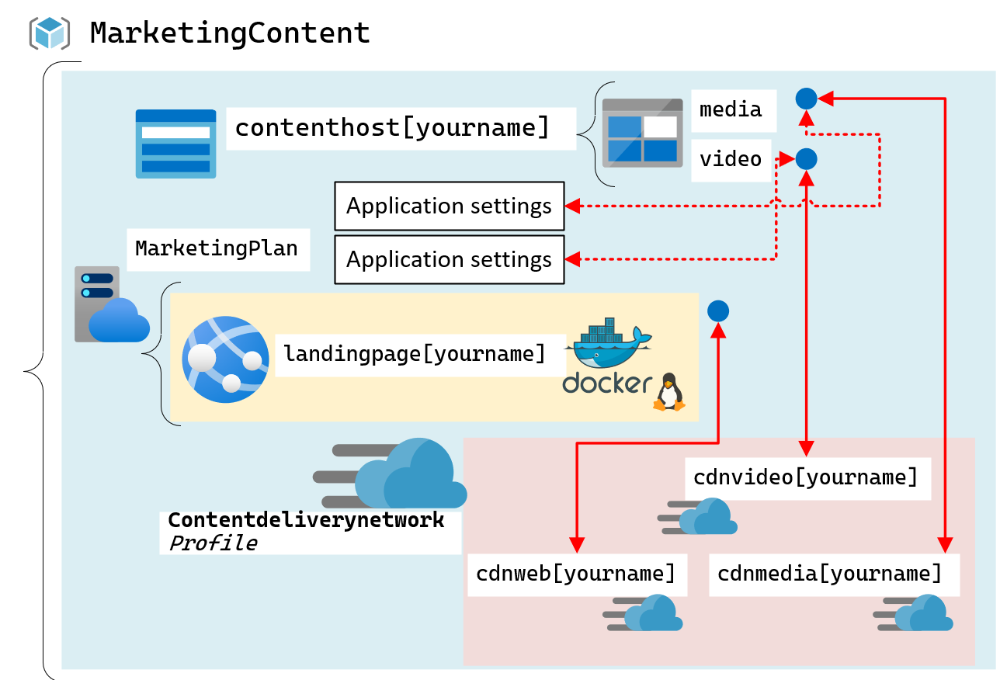
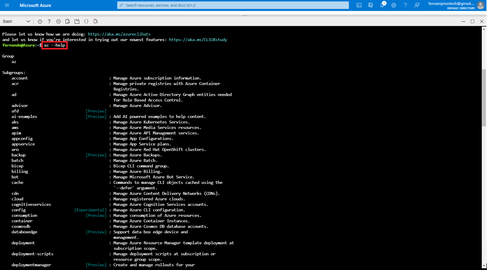
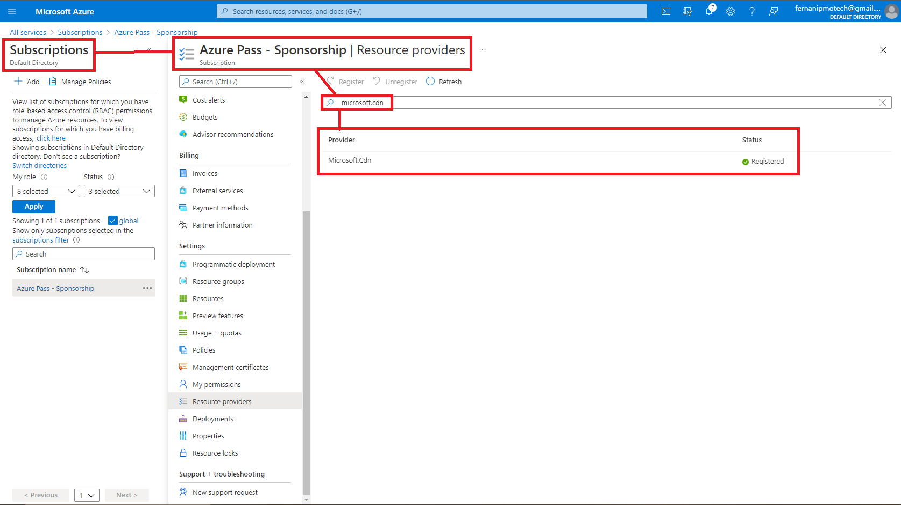
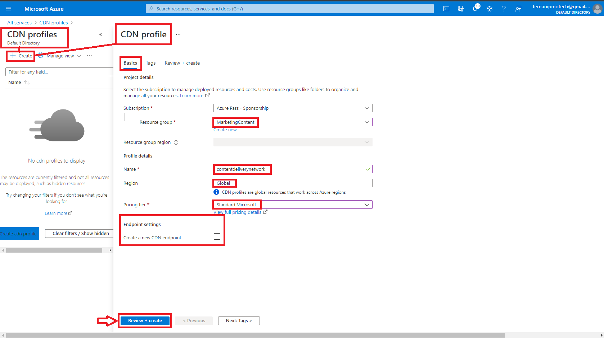
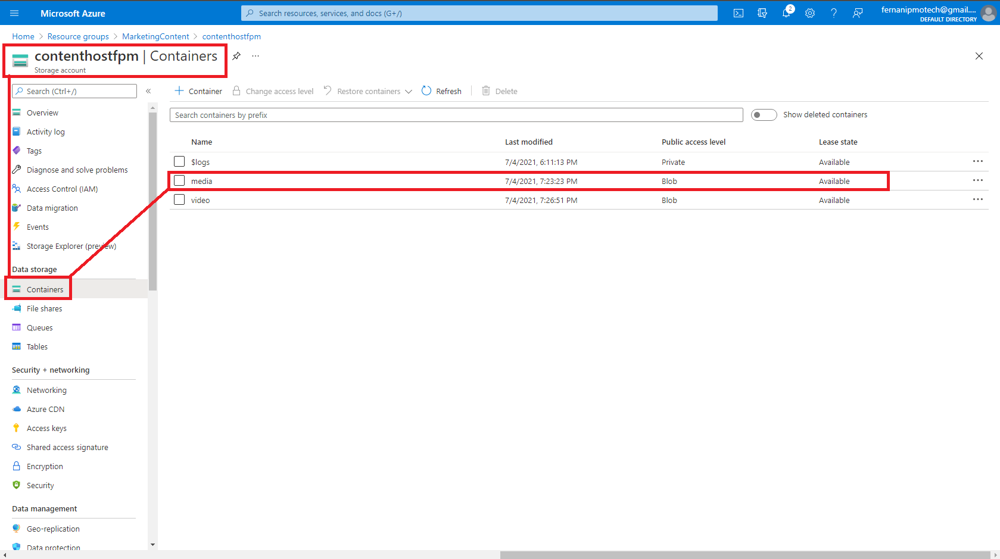
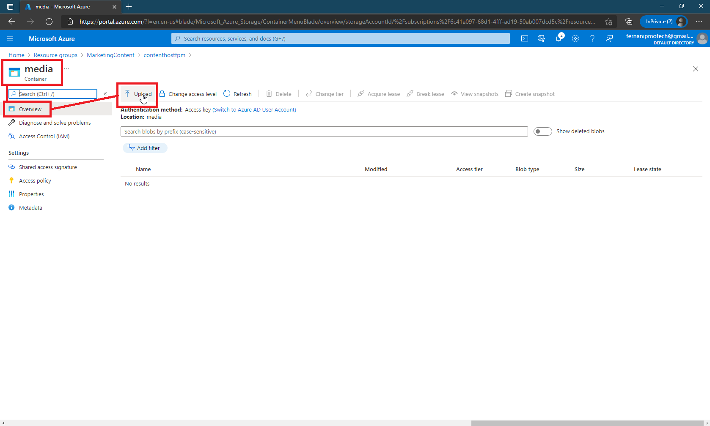
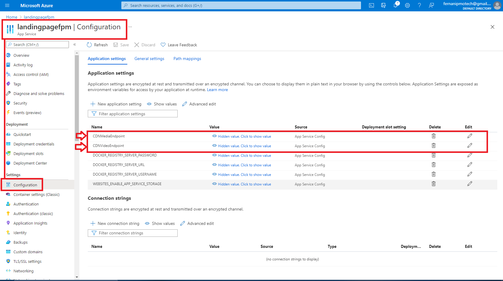
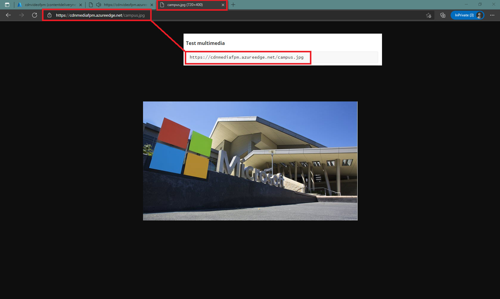
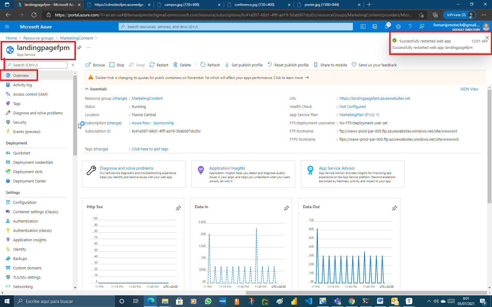

# Lab 12: Enhancing a web application by using the Azure Content Delivery Network

## Microsoft Azure user interface

Given the dynamic nature of Microsoft cloud tools, you might experience Azure UI changes after the development of this training content. These changes might cause the lab instructions and lab steps to not match up.

Microsoft updates this training course when the community brings needed changes to our attention; however, because cloud updates occur frequently, you might encounter UI changes before this training content updates. **If this occurs, adapt to the changes, and then work through them in the labs as needed.**

## Instructions

### Before you start

#### Sign in to the lab virtual machine

Sign in to your Windows 10 virtual machine (VM) by using the following credentials:

- Username: **Admin**
- Password: **Pa55w.rd**

> **Note**: Instructions to connect to the virtual lab environment will be provided by your instructor.

#### Review the installed applications

Find the taskbar on your Windows 10 desktop. The taskbar contains the icon for the application that you’ll use in this lab:

- Microsoft Edge

  

**Architecture**



### Exercise 1: Create Azure resources

#### Task 1: Open the Azure portal

1. On the taskbar, select the **Microsoft Edge** icon.

2. In the open browser window, go to the Azure portal ([https://portal.azure.com](https://portal.azure.com/)).

3. Enter the email address for your Microsoft account, and then select **Next**.

4. Enter the password for your Microsoft account, and then select **Sign in**.

   > **Note**: If this is your first time signing in to the Azure portal, you’ll be offered a tour of the portal. Select **Get Started** to skip the tour and begin using the portal.

#### Task 2: Create a Storage account

1. In the Azure portal’s navigation pane, select **All services**.

2. On the **All services** blade, select **Storage Accounts**.

3. On the **Storage accounts** blade, find your list of Storage instances.

   

4. On the **Storage accounts** blade, select **Create**.

   

5. Find the tabs on the **Create storage account** blade, such as **Basics**.

   > **Note**: Each tab represents a step in the workflow to create a new storage account. You can select **Review + Create** at any time to skip the remaining tabs.

6. On the **Basics** tab, perform the following actions:

   1. Leave the **Subscription** text box set to its default value.

   2. In the **Resource group** section, select **Create new**, enter **MarketingContent**, and then select **OK**.

   3. In the **Storage account name** text box, enter **contenthost\*[yourname]\***.

   4. In the **Location** drop-down list, select the **(US) East US** region.

   5. In the **Performance** section, select **Standard**.

   6. In the **Redundancy** drop-down list, select **Locally-redundant storage (LRS)**.

   7. Select **Review + Create**.

      

7. On the **Review + Create** tab, review the options that you selected during the previous steps.

8. Select **Create** to create the storage account by using your specified configuration.

   

   > **Note**: Wait for the creation task to complete before you move forward with this lab.


#### Task 3: Create a web app by using Azure App Service

1. In the Azure portal’s navigation pane, select **Create a resource**.

2. On the **Create a resource** blade, find the **Search services and marketplace** text box.

3. In the search box, enter **Web App**, and then select Enter.

4. On the **Everything** search results blade, select the **Web App** result.

   

5. On the **Web App** blade, select **Create**.

   

6. On the **Create Web App** blade, find the tabs on the blade, such as **Basics**.

   > **Note**: Each tab represents a step in the workflow to create a new web app. You can select **Review + Create** at any time to skip the remaining tabs.

7. On the **Basics** tab, perform the following actions:

   1. Leave the **Subscription** text box set to its default value.

   2. In the **Resource group** section, select **MarketingContent**.

   3. In the **Name** text box, enter **landingpage\*[yourname]\***.

   4. In the **Publish** section, select **Docker Container**.

   5. In the **Operating System** section, select **Linux**.

   6. In the **Region** drop-down list, select the **East US** region.

   7. In the **Linux Plan (East US)** section, select **Create new**, enter the value **MarketingPlan** in the **Name** text box, and then select **OK**.

   8. Leave the **SKU and size** section set to its default value.

   9. Select **Next: Docker**.

      

8. On the **Docker** tab, perform the following actions:

   1. In the **Options** drop-down list, select **Single Container**.

   2. In the **Image Source** drop-down list, select **Docker Hub**.

   3. In the **Access Type** drop-down list, select **Public**.

   4. In the **Image and tag** text box, enter **microsoftlearning/edx-html-landing-page:latest**.

   5. Select **Review + Create**.

      

9. On the **Review + Create** tab, review the options that you selected during the previous steps.

10. Select **Create** to create the web app by using your specified configuration.

    

    > **Note**: Wait for the creation task to complete before you move forward with this lab.

    

    

11. In the Azure portal’s navigation pane, select **Resource groups**.

12. On the **Resource groups** blade, select the **MarketingContent** resource group that you created earlier in this lab.

13. On the **MarketingContent** blade, select the **landingpage\*[yourname]\*** web app that you created earlier in this lab.

14. On the **App Service** blade, in the **Settings** category, select the **Properties** link.

15. In the **Properties** section, record the value of the **URL** text box. You’ll use this value later in the lab.


#### Review

In this exercise, you created an Azure Storage account and an Azure Web App that you’ll use later in this lab.

### Exercise 2: Configure Content Delivery Network and endpoints

#### Task 1: Open Azure Cloud Shell

1. In the Azure portal, select the **Cloud Shell** icon to open a new shell instance.

   > **Note**: The **Cloud Shell** icon is represented by a greater than sign (>) and underscore character (_).

2. If this is your first time opening Cloud Shell using your subscription, you can use the **Welcome to Azure Cloud Shell Wizard** to configure Cloud Shell for first-time usage. Perform the following actions in the wizard:

   - A dialog box prompts you to configure the shell. Select **Bash**, review the selected subscription, and then select **Create storage**.

   > **Note**: Wait for Cloud Shell to finish its initial setup procedures before moving forward with the lab. If you don’t notice the **Cloud Shell** configuration options, this is most likely because you’re using an existing subscription with this course’s labs. The labs are written with the presumption that you’re using a new subscription.

3. At the **Cloud Shell** command prompt in the portal, enter the following command, and then select Enter to get the version of the Azure Command-Line Interface (Azure CLI) tool:

   CodeCopy

   ```
   az --version
   ```


#### Task 2: Register the Microsoft.CDN provider

1. At the **Cloud Shell** command prompt in the portal, perform the following actions:

   1. Enter the following command, and then select Enter to get a list of subgroups and commands at the root level of the Azure CLI:

      CodeCopy

      ```
      az --help
      ```

      

      

      

      

   2. Enter the following command, and then select Enter to get a list of the commands that are available for resource providers:

      CodeCopy

      ```
      az provider --help
      ```

      

   3. Enter the following command, and then select Enter to list all currently registered providers:

      CodeCopy

      ```
      az provider list
      ```

      

      

      

      

      

      

      

      

   4. Enter the following command, and then select Enter to list just the namespaces of the currently registered providers:

      CodeCopy

      ```
      az provider list --query "[].namespace"
      ```

      

      

      

      

      

      

   5. Observe the list of currently registered providers. The **Microsoft.CDN** provider isn’t currently in the list of providers.

   6. Enter the following command, and then select Enter to get the required flags to register a new provider:

      CodeCopy

      ```
      az provider register --help
      ```

      

   7. Enter the following command, and then select Enter to register the **Microsoft.CDN** namespace with your current subscription:

      CodeCopy

      ```
      az provider register --namespace Microsoft.CDN
      ```

   

   

   

2. Close the Cloud Shell pane in the portal.

#### Task 3: Create a Content Delivery Network profile

1. In the Azure portal’s navigation pane, select **Create a resource**.

2. On the **Create a resource** blade, find the **Search services and marketplace** text box.

3. In the search box, enter **CDN**, and then select Enter.

   

4. On the **Marketplace** search results blade, select the **CDN** result.

5. On the **CDN** blade, select **Create**.

   

6. Find the tabs on the **CDN profile** blade, such as **Basics**.

   > **Note**: Each tab represents a step in the workflow to create a new CDN profile. You can select **Review + Create** at any time to skip the remaining tabs.

7. On the **Basics** tab, perform the following actions:

   1. Leave the **Subscription** text box set to its default value.
   2. In the **Resource group** section, select **MarketingContent**.
   3. In the **Name** text box, enter **contentdeliverynetwork**.
   4. Leave the **Region** drop-down list set to its default value (**Global**).
   5. In the **Pricing tier** drop-down list, select **Standard Microsoft**.
   6. Ensure that the **Create a new CDN endpoint now** check box is cleared.
   7. Select **Review + Create**.

8. On the **Review + Create** tab, review the options that you selected during the previous steps.

   

9. Select **Create** to create the CDN profile by using your specified configuration.

   

   > **Note**: Wait for Azure to finish creating the CDN profile before you move forward with the lab. You’ll receive a notification when the app is created.


#### Task 4: Configure Storage containers

1. In the Azure portal’s navigation pane, select **Resource groups**.

2. On the **Resource groups** blade, select the **MarketingContent** resource group that you created earlier in this lab.

3. On the **MarketingContent** blade, select the **contenthost\*[yourname]\*** storage account that you created earlier in this lab.

   

4. On the **Storage account** blade, select the **Containers** link in the **Data storage** section.

5. In the **Containers** section, select **+ Container**.

   

6. In the **New container** pop-up window, perform the following actions:

   1. In the **Name** text box, enter **media**.

   2. In the **Public access level** drop-down list, select **Blob (anonymous read access for blobs only)**,

   3. Select **Create**.

      

7. Back in the **Containers** section, select **+ Container** again.

   

8. In the **New container** pop-up window, perform the following actions:

   1. In the **Name** text box, enter **video**.

   2. In the **Public access level** drop-down list, select **Blob (anonymous read access for blobs only)**,

   3. Select **Create**.

      

9. Observe the updated list of containers.

   

   

#### Task 5: Create Content Delivery Network endpoints

1. In the Azure portal’s navigation pane, select the **Resource groups** link.

2. On the **Resource groups** blade, find and then select the **MarketingContent** resource group that you created earlier in this lab.

3. On the **MarketingContent** blade, select the **contentdeliverynetwork** CDN profile that you created earlier in this lab.

   

4. On the **CDN profile** blade, select **+ Endpoint**.

5. In the **Add an endpoint** pop-up dialog box, perform the following actions:

   

   1. In the **Name** text box, enter **cdnmedia\*[yourname]\***.

   2. In the **Origin type** drop-down list, select **Storage**.

   3. In the **Origin hostname** drop-down list, select the **contenthost\*[yourname]\*.blob.core.windows.net** option for the Storage account that you created earlier in this lab.

   4. In the **Origin path** text box, enter **/media**.

   5. Leave the **Origin host header** text box set to its default value.

   6. Leave the **Protocol** and **Origin port** sections set to their default values.

   7. In the **Optimized for** drop-down list, select **General web delivery**.

   8. Select **Add**.

      

6. Back on the **CDN profile** blade, select **+ Endpoint** again.

   

7. In the **Add an endpoint** pop-up dialog box, perform the following actions:

   1. In the **Name** text box, enter **cdnvideo\*[yourname]\***.

   2. In the **Origin type** drop-down list, select **Storage**.

   3. In the **Origin hostname** drop-down list, select the **contenthost\*[yourname]\*.blob.core.windows.net** option for the Storage account that you created earlier in this lab.

   4. In the **Origin path** text box, enter **/video**.

   5. Leave the **Origin host header** text box set to its default value.

   6. Leave the **Protocol** and **Origin port** sections set to their default values.

   7. In the **Optimized for** drop-down list, select **Video on demand media streaming**.

   8. Select **Add**.

      

8. Back on the **CDN profile** blade, select **+ Endpoint** again.

   

9. In the **Add an endpoint** pop-up dialog box, perform the following actions:

   1. In the **Name** text box, enter **cdnweb\*[yourname]\***.

   2. In the **Origin type** drop-down list, select **Web App**.

   3. In the **Origin hostname** drop-down list, select the **landingpage\*[yourname]\*.azurewebsites.net** option for the Web App that you created earlier in this lab.

   4. Leave the **Origin path** text box set to its default value.

   5. Leave the **Origin host header** text box set to its default value.

   6. Leave the **Protocol** and **Origin port** sections set to their default values.

   7. In the **Optimized for** drop-down list, select **General web delivery**.

   8. Select **Add**.

      

      

#### Review

In this exercise, you registered the resource provider for Content Delivery Network and then used the provider to create both CDN profile and endpoint resources.

### Exercise 3: Upload and configure static web content

#### Task 1: Observe the landing page

1. In the Azure portal’s navigation pane, select **Resource groups**.

2. On the **Resource groups** blade, select the **MarketingContent** resource group that you created earlier in this lab.

3. On the **MarketingContent** blade, select the **landingpage\*[yourname]\*** web app that you created earlier in this lab.

   

4. On the **App Service** blade, select **Browse**. A new browser window or tab will open and return the current website.

   

5. Observe the error message displayed on the screen. The website won’t work until you configure the specified settings to reference multimedia content.

   

6. Return to your currently open browser window that’s displaying the Azure portal.

#### Task 2: Upload Storage blobs

1. In the Azure portal’s navigation pane, select **Resource groups**.

2. On the **Resource groups** blade, select the **MarketingContent** resource group that you created earlier in this lab.

3. On the **MarketingContent** blade, select the **contenthost\*[yourname]\*** storage account that you created earlier in this lab.

   

4. On the **Storage account** blade, select the **Containers** link in the **Data storage** section.

5. In the **Containers** section, select the **media** container.

6. On the **Container** blade, select **Upload**.

   

7. In the **Upload blob** pop-up window, perform the following actions:

   

   1. In the **Files** section, select the **Folder** icon.

   2. In the **File Explorer** window, browse to **Allfiles (F):\Allfiles\Labs\12\Starter**, select the following files, and then select **Open**:

      - **campus.jpg**
      - **conference.jpg**
      - **poster.jpg**

   3. Ensure that **Overwrite if files already exist** is selected, and then select **Upload**.

      

   > **Note**: Wait for the blob to upload before you continue with this lab.

   

   

8. Back on the **Container** blade, select **Properties** in the **Settings** section.

9. Record the value in the **URL** text box. You will use this value later in the lab.

10. Close the **Container** blade.

11. Back on the **Containers** blade, select the **video** container.

    

12. On the **Container** blade, select **Upload**.

    

13. In the **Upload blob** pop-up window, perform the following actions:

    1. In the **Files** section, select the **Folder** icon.

    2. In the **File Explorer** window, browse to **Allfiles (F):\Allfiles\Labs\12\Starter**, select the **welcome.mp4** file, and then select **Open**.

    3. Ensure that **Overwrite if files already exist** is selected, and then select **Upload**.

       

    > **Note**: Wait for the blob to upload before you continue with this lab.

    

    

14. Back on the **Container** blade, select **Properties** in the **Settings** section.

15. Record the value in the **URL** text box. You will use this value later in the lab.

    

#### Task 3: Configure Web App settings

1. In the Azure portal’s navigation pane, select **Resource groups**.

2. On the **Resource groups** blade, select the **MarketingContent** resource group that you created earlier in this lab.

3. On the **MarketingContent** blade, select the **landingpage\*[yourname]\*** web app that you created earlier in this lab.

   

4. On the **App Service** blade, in the **Settings** category, select the **Configuration** link.

5. In the **Configuration** section, perform the following actions:

   1. Select the **Application settings** tab, and then select **New application setting**.

      

   2. In the **Add/Edit application setting** pop-up window, in the **Name** text box, enter **CDNMediaEndpoint**.

   3. In the **Value** text box, enter the **URI** value of the **media** container in the **contenthost\*[yourname]\*** storage account that you recorded earlier in this lab.

      

   4. Leave the **deployment slot setting** text box set to its default value, and then select **OK** to close the pop-up window.

   5. Return to the **Configuration** section, and then select **New application setting**.

      

   6. In the **Add/Edit application setting** pop-up window, in the **Name** text box, enter **CDNVideoEndpoint**.

   7. In the **Value** text box, enter the **URI** value of the **video** container in the **contenthost\*[yourname]\*** storage account that you recorded earlier in this lab.

      

   8. Leave the **deployment slot setting** text box set to its default value, and then select **OK** to close the pop-up window.

   9. Return to the **Configuration** section, and then select **Save** on the blade to persist your settings.

      

      

   > **Note**: Wait for your application settings to persist before you move forward with the lab.



#### Task 4: Validate the corrected landing page

1. In the Azure portal’s navigation pane, select **Resource groups**.

2. On the **Resource groups** blade, select the **MarketingContent** resource group that you created earlier in this lab.

3. On the **MarketingContent** blade, select the **landingpage\*[yourname]\*** web app that you created earlier in this lab.

4. On the **App Service** blade, select **Restart**. This operation will restart the Web App.

   

   > **Note**: Wait for the restart operation to complete before you move forward with the lab. You’ll receive a notification when the operation is done.

   

5. Back on the **App Service** blade, select **Browse**. A new browser window or tab will open and return the current website.

   

6. Observe the updated website rendering multimedia content of various types.

   

   

7. Return to your currently open browser window that’s displaying the Azure portal.

#### Review

In this exercise, you uploaded multimedia content as blobs to Storage containers and then updated your Web App to point directly to the storage blobs.

### Exercise 4: Use Content Delivery Network endpoints

#### Task 1: Retrieve endpoint URIs

1. In the Azure portal’s navigation pane, select the **Resource groups** link.

2. On the **Resource groups** blade, find and then select the **MarketingContent** resource group that you created earlier in this lab.

3. On the **MarketingContent** blade, select the **contentdeliverynetwork** CDN profile that you created earlier in this lab.

   

4. On the **CDN profile** blade, select the **cdnmedia\*[yourname]\*** endpoint.

   

5. On the **Endpoint** blade, copy the value of the **Endpoint hostname** text box. You will use this value later in the lab.

   

6. Close the **Endpoint** blade.

7. Back on the **CDN profile** blade, select the **cdnvideo\*[yourname]\*** endpoint.

   

8. On the **Endpoint** blade, copy the value of the **Endpoint hostname** text box. You will use this value later in the lab.

   

9. Close the **Endpoint** blade.

#### Task 2: Test multimedia content

1. Construct a URL for the **campus.jpg** resource by combining the **Endpoint hostname** URL from the **cdnmedia\*[yourname]\*** endpoint that you copied earlier in the lab with a relative path of **/campus.jpg**.

   > **Note**: For example, if your **Endpoint hostname** URL is **https://cdnmediastudent.azureedge.net/**, your newly constructed URL would be **https://cdnmediastudent.azureedge.net/campus.jpg**.

   

2. Construct a URL for the **conference.jpg** resource by combining the **Endpoint hostname** URL from the **cdnmedia\*[yourname]\*** endpoint that you copied earlier in the lab with a relative path of **/conference.jpg**.

   > **Note**: For example, if your **Endpoint hostname** URL is **https://cdnmediastudent.azureedge.net/**, your newly constructed URL would be **https://cdnmediastudent.azureedge.net/conference.jpg**.

   

3. Construct a URL for the **poster.jpg** resource by combining the **Endpoint hostname** URL from the **cdnmedia\*[yourname]\*** endpoint that you copied earlier in the lab with a relative path of **/poster.jpg**.

   > **Note**: For example, if your **Endpoint hostname** URL is **https://cdnmediastudent.azureedge.net/**, your newly constructed URL would be **https://cdnmediastudent.azureedge.net/poster.jpg**.

   

4. Construct a URL for the **welcome.mp4** resource by combining the **Endpoint hostname** URL from the **cdnvideo\*[yourname]\*** endpoint that you copied earlier in the lab with a relative path of **/welcome.mp4**.

   > **Note**: For example, if your **Endpoint hostname** URL is **https://cdnvideostudent.azureedge.net/**, your newly constructed URL would be **https://cdnvideostudent.azureedge.net/welcome.mp4**.

   

5. On the taskbar, right-click the **Microsoft Edge** icon or activate the shortcut menu, and then select **New window**.

6. In the new browser window, go to the URL that you constructed for the **campus.jpg** media resource, and then verify that the resource was successfully found.

   

   > **Note**: If the content isn’t available yet, the CDN endpoint is still initializing. This initialization process can take anywhere from 5 to 15 minutes.

7. Go to the URL that you constructed for the **conference.jpg** media resource, and then verify that the resource was successfully found.

   

8. Go to the URL that you constructed for the **poster.jpg** media resource, and then verify that the resource was successfully found.

   

9. Go to the URL that you constructed for the **welcome.mp4** video resource, and then verify that the resource was successfully found.

   

10. Close the browser window that you created in this task.

#### Task 3: Update the Web App settings

1. In the Azure portal’s navigation pane, select **Resource groups**.

2. On the **Resource groups** blade, select the **MarketingContent** resource group that you created earlier in this lab.

3. On the **MarketingContent** blade, select the **landingpage\*[yourname]\*** web app that you created earlier in this lab.

   

4. On the **App Service** blade, in the **Settings** category, select the **Configuration** link.

5. In the **Configuration** section, perform the following actions:

   1. Select the **Application settings** tab.

   2. Select the existing **CDNMediaEndpoint** application setting.

      

   3. In the **Add/Edit application setting** pop-up dialog box, update the **Value** text box by entering the **Endpoint hostname** URL from the **cdnmedia\*[yourname]\*** endpoint that you copied earlier in the lab, and then select **OK**.

      

      

   4. Select the existing **CDNVideoEndpoint** application setting.

      

   5. In the **Add/Edit application setting** pop-up dialog box, update the **Value** text box by entering the **Endpoint hostname** URL from the **cdnvideo\*[yourname]\*** endpoint that you copied earlier in the lab, and then selec **OK**.

      

      

   6. Select **Save** on the blade to persist your settings.

      

      

   > **Note**: Wait for your application settings to persist before you move forward with the lab.

   

6. Back in the **Configuration** section, select **Overview**.

7. In the **Overview** section, select **Restart**. This operation will restart the Web App.

   

   > **Note**: Wait for the restart operation to complete before you move forward with the lab. You’ll receive a notification when the operation is done.



#### Task 4: Test the web content

1. In the Azure portal’s navigation pane, select the **Resource groups** link.

2. On the **Resource groups** blade, find and then select the **MarketingContent** resource group that you created earlier in this lab.

   

3. On the **MarketingContent** blade, select the **contentdeliverynetwork** CDN profile that you created earlier in this lab.

4. On the **CDN profile** blade, select the **cdnweb\*[yourname]\*** endpoint.

   

5. On the **Endpoint** blade, copy the value of the **Endpoint hostname** text box.

   

6. On the taskbar, right-click the **Microsoft Edge** icon or activate the shortcut menu, and then select **New window**.

7. In the new browser window, go to the **Endpoint hostname** URL for the **cdnweb\*[yourname]\*** endpoint.

   

8. Observe the website and multimedia content that are all served using Content Delivery Network.

   

#### Review

In this exercise, you updated your Web App to use Content Delivery Network to serve multimedia content and to serve the web application itself.

### Exercise 5: Clean up your subscription

#### Task 1: Open Azure Cloud Shell and list resource groups

1. In the Azure portal’s navigation pane, select the **Cloud Shell** icon to open a new shell instance.

   > **Note**: The **Cloud Shell** icon is represented by a greater than sign (>) and underscore character (_).

2. If this is your first time opening Cloud Shell using your subscription, you can use the **Welcome to Azure Cloud Shell Wizard** to configure Cloud Shell for first-time usage. Perform the following actions in the wizard:

   1. A dialog box prompts you to configure the shell. Select **Bash**, review the selected subscription, and then select **Create storage**.

   > **Note**: Wait for Cloud Shell to finish its initial setup procedures before moving forward with the lab. If you don’t notice Cloud Shell configuration options, this is most likely because you’re using an existing subscription with this course’s labs. The labs are written with the presumption that you’re using a new subscription.

#### Task 2: Delete a resource group

1. Enter the following command, and then select Enter to delete the **MarketingContent** resource group:

   CodeCopy

   ```
   az group delete --name MarketingContent --no-wait --yes
   ```

   

   

2. Close the Cloud Shell pane in the portal.

   

#### Task 3: Close the active application

1. the currently running Microsoft Edge application.

#### Review

In this exercise, you cleaned up your subscription by removing the resource group that was used in this lab.